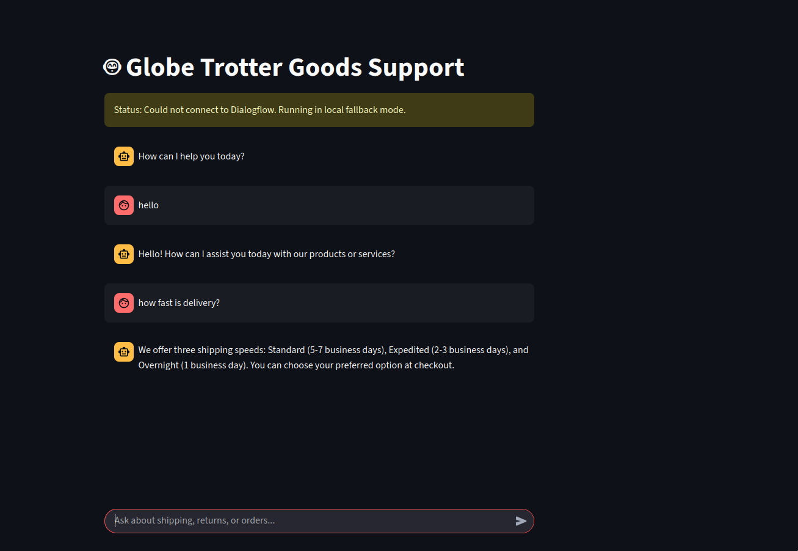

# AI-Powered Customer Support Chatbot with Smart Fallback


**Check out the live, deployed chatbot here:** [https://futureml03-jmunnvhceweixxx2ramehx.streamlit.app/] 

## 1. Project Overview

This project is a complete, end-to-end customer support chatbot designed to provide instant, 24/7 assistance for an e-commerce platform. It showcases a hybrid architecture that combines the power of a major cloud AI service (Google Dialogflow CX) with the reliability of a self-contained, local AI model.

The result is a resilient, user-friendly web application built with Streamlit that can intelligently answer a wide range of frequently asked questions about orders, shipping, returns, and more.


 
## 2. Key Features & Technical Highlights

This project was built to meet and exceed the requirements of a modern conversational AI task.

### ✔ Greeting & Natural Conversation
The bot handles simple greetings (like "how are you" or "hello") and natural conversation enders (like "thank you"), providing a smooth user experience.

### ✔ Comprehensive FAQ Answering
The bot is trained to answer a wide array of common customer questions, including:
- Order status and tracking
- Shipping options and delivery times
- Return policies and processes
- Payment methods and security
- Damaged items and cancellations

### ✔ Smart Fallback System (System Resilience)
This is the core architectural feature. The application is designed to be highly available:

- **Primary Engine:** It first attempts to connect to the powerful Google Dialogflow CX agent for the most advanced intent recognition.
- **Secondary (Fallback) Engine:** If the connection to the Google Cloud service fails for any reason (e.g., API key issue, network error), the application seamlessly switches to a self-contained semantic search bot. This local bot uses a Sentence-Transformer model to understand user queries and provide answers from a cached knowledge base.
- **Status Indicator:** The UI transparently informs the user which engine is currently active.

### ✔ Interactive Web Interface
A clean, modern chat interface was built using Streamlit, allowing for easy interaction and demonstration.

### ✔ Cloud Deployment
The final application is containerized and deployed on Streamlit Community Cloud, making it a publicly accessible, production-ready demonstration of the system.

## 3. The AI Behind the Bot

Two distinct AI models power this chatbot:

### A. Google Dialogflow CX (Primary)
- **What it is:** A state-of-the-art, enterprise-grade platform for building conversational agents.
- **How it was used:** I designed a complete conversational flow with multiple Intents (order.status, returns.policy, etc.), each trained with a diverse set of user Training Phrases. This allows the bot to robustly classify user intent.  

### B. Sentence Transformers (Fallback)
- **What it is:** A Python framework for state-of-the-art text embedding. We used the all-MiniLM-L6-v2 model.
- **How it was used:**
  - **Offline Processing:** The questions from our knowledge base (faq_data.json) were converted into numerical vectors (embeddings) and saved. This "brain" file (faq_embeddings.npy) is deployed with the app.
  - **Real-time Inference:** When a user asks a question, the model converts it into a vector and uses Cosine Similarity to find the best match from the pre-computed question vectors. This semantic search understands the meaning of the query, not just keywords.

## 4. Project Structure

The repository is organized to separate the notebook, application code, data, and model assets.

```
FUTURE_ML_03_Chatbot/
├── notebooks/
│   └── 01_build_chatbot_assets.ipynb # Generates embeddings for the local bot
├── data/
│   └── faq_data.json         # The knowledge base (Q&A pairs)
├── models/
│   └── faq_embeddings.npy    # The pre-computed "brain" for the local bot
├── app.py                    # The main Streamlit application script
├── .gitignore                # Ignores secrets and cache files
└── requirements.txt          # Python dependencies
```

## 5. How to Run Locally

### Prerequisites:
- Python 3.9
- A `google_credentials.json` file obtained from the Google Cloud Console  .

### Steps:

1. **Clone the repository:**
   ```bash
   git clone https://github.com/your-username/FUTURE_ML_03_Chatbot.git
   cd FUTURE_ML_03_Chatbot
   ```

2. **Create and activate a Conda environment:**
   ```bash
   conda create --name chatbot_env python=3.9 -y
   conda activate chatbot_env
   ```

3. **Install the required dependencies:**
   ```bash
   pip install -r requirements.txt
   ```

4. **Generate Local Bot Assets (if needed):**
   If `models/faq_embeddings.npy` doesn't exist, run the Jupyter Notebook:
   ```bash
   jupyter notebook notebooks/01_build_chatbot_assets.ipynb
   ```
   (Then run all cells inside the notebook).

5. **Run the Streamlit app:**
   ```bash
   streamlit run app.py
   ```

6. The application will open in your default web browser.

## 6. Technologies Used

- **Python 3.9** - Core programming language
- **Streamlit** - Web application framework
- **Google Dialogflow CX** - Primary conversational AI service
- **Sentence Transformers** - Semantic text similarity for fallback
- **NumPy** - Numerical computing for embeddings
- **JSON** - Data storage format for FAQ knowledge base

## 7. Future Enhancements

- Integration with live order tracking APIs
- Multi-language support
- Voice interaction capabilities
- Analytics dashboard for conversation insights
- Advanced sentiment analysis

## 8. Contributing

1. Fork the repository
2. Create a feature branch (`git checkout -b feature/AmazingFeature`)
3. Commit your changes (`git commit -m 'Add some AmazingFeature'`)
4. Push to the branch (`git push origin feature/AmazingFeature`)
5. Open a Pull Request

## 9. License

This project is licensed under the MIT License - see the [LICENSE](LICENSE) file for details.

## 10. Contact

Charles Mutembei - cmutembei73@gmail.com

Project Link: [https://futureml03-jmunnvhceweixxx2ramehx.streamlit.app/] 